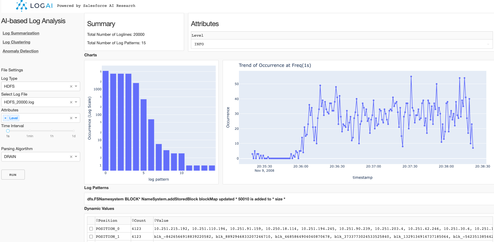

<!--
Copyright (c) 2022 Salesforce.com, inc.
All rights reserved.
SPDX-License-Identifier: BSD-3-Clause
For full license text, see the LICENSE file in the repo root or https://opensource.org/licenses/BSD-3-Clause

-->

<p align="center">
    <br>
    
    </br>
</p>

<div align="center">
  <a href="https://github.com/salesforce/logai/actions/workflows/tests.yml">
    
  </a>
  <a href="https://opensource.org/licenses/BSD-3-Clause">
    
  </a>
</div>

# LogAI: A Python Toolkit for AI-based Log Analytics

## What is LogAI?

LogAI is a one-stop python toolkit for AI-based log analysis. LogAI provides artificial intelligence (AI) and machine learning (ML) capabilities for log analysis. 
LogAI can be used for a variety of tasks such as log summarization, log clustering and log anomaly detection. 
LogAI adopts the same log data model as OpenTelemetry so the developed applications and models are eligible to logs from different log management platforms. 
LogAI provides a unified model interface and integrates with popular time-series models, statistical learning models and deep learning models. 
LogAI also provides an out-of-the-box GUI for users to conduct interactive analysis. With LogAI, we can also easily benchmark popular deep learning algorithms for log anomaly detection without putting in redundant effort to process the logs. 

## How to Use LogAI

#### Install LogAI:

```shell
git clone https://git.soma.salesforce.com/SalesforceResearch/logai.git
cd logai
python3 -m venv venv # create virtual environment
source venv/bin/activate # activate virtual env
pip install ./ # install LogAI from root directory
```

### Build LogAI Application
Please refer to [Build LogAI Application in Jupyter Notebook](./tutorials/jupyter_notebook/jupyter_tutorial.md) for more information about how to
use LogAI modules to create E2E applications in Jupyter Notebook.

### Use GUI to explore LogAI

```shell
export PYTHONPATH='.'  # make sure to add current root to PYTHONPATH
python3 gui/application.py # Run local plotly dash server.
```

Then open the LogAI portal via http://localhost:8050/ or http://127.0.0.1:8050/ in your browser:



### Run Anomaly Detection Benchmarking Using LogAI

(TBA)


## LogAI compare to other open-source projects about AI-based log analytics

There are a few existing open-source code repos which conducts AI-based log analytics taks. 
Below table compares LogAI with these projects on several aspects. 

| Coverage  | LogAI | NewRelic Log Monitoring | DataDog Log Explorer | logparser | loglizer | deep-loglizer | log3C | 
| ------------- | ------------- | ------------- |  ------------- | ------------- | ------------- | ------------- | ------------- |
| OpenTelemetry log data model  | :white_check_mark:  | :white_check_mark:  | :white_check_mark:  | | | | | | 
| Unified data loader and preprocessing | :white_check_mark:  | :white_check_mark:  | :white_check_mark:  | :white_check_mark:  | :white_check_mark:  | :white_check_mark: | |
| Auto log parsing  | :white_check_mark:  | :white_check_mark: | :white_check_mark: | | | 
| Log clustering | :white_check_mark: | :white_check_mark:  | :white_check_mark:  | | | | :white_check_mark: | 
| Log anomaly detection - time-series | :white_check_mark: | :white_check_mark:  | :white_check_mark:  | | | | | | 
| Log anomaly detection - traditional ML | :white_check_mark: |  |  | | :white_check_mark: |  |  |  
| Log anomaly detection - deep Learning | :white_check_mark: |  | | | :white_check_mark: | :white_check_mark: |  |  
| Huggingface integration (TBD) | :white_check_mark: | | | | | |  |
| GUI for result visualization (TBD) | :white_check_mark: | :white_check_mark: | :white_check_mark: | | | | | 


