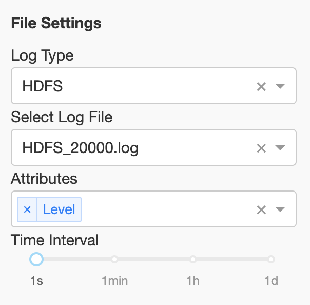
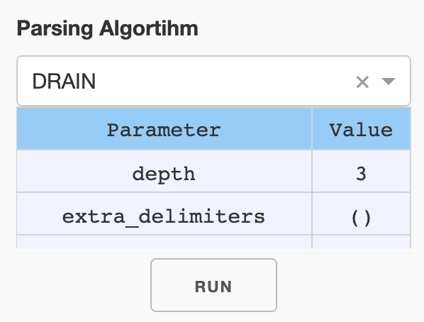

<!--
Copyright (c) 2022 Salesforce.com, inc.
All rights reserved.
SPDX-License-Identifier: BSD-3-Clause
For full license text, see the LICENSE file in the repo root or https://opensource.org/licenses/BSD-3-Clause

-->

<p align="center">
    <br>
    
    </br>
</p>

<div align="center">
  <a href="https://github.com/salesforce/logai/actions/workflows/tests.yml">
    
  </a>
  <a href="https://github.com/salesforce/logai/actions/workflows/pages/pages-build-deployment">
    
  </a>
  <a href="https://opensource.org/licenses/BSD-3-Clause">
    
  </a>
</div>

# LogAI: A Python Toolkit for AI-based Log Analytics

## Table of Contents
1. [Introduction](#introduction)
1. [Installation](#installation)
1. [Documentation](#documentation)

1. [Evaluation and Benchmarking](#evaluation-and-benchmarking)
1. [Technical Report and Citing LogAI](#technical-report-and-citing-logai)

## Introduction

Logs are the machine generated text messages of a computer program. In modern computer systems, logs are one of the most 
critical observability data for developers to understand system behavior, monitor system health and resolve issues. 
The volume of logs are huge for complex distributed systems, such as cloud, search engine, social media, etc. Log analytics, 
are tools for developers to process huge volume of raw logs and generate insights, in order to better handle system 
operations. While artificial intelligence (AI) and machine learning (ML) technologies are proven to be capable to improve 
productivity in a lot of domains, recently more and more AI tools are integrated in log analytics solutions, in both 
commercial and opensource software. However, there is still no sufficient toolkit that can handle multiple AI-based 
log analysis tasks in uniform way. We introduce LogAI, an one-stop toolkit for AI-based log analytics. 
LogAI provides AI and ML capabilities for log analysis. LogAI can be used for a variety of tasks such as log summarization, 
log clustering and log anomaly detection. LogAI adopts the same log data model as OpenTelemetry so the developed applications 
and models are eligible to logs from different log management platforms. LogAI provides a unified model interface and 
integrates with popular time-series models, statistical learning models and deep learning models. LogAI also provides 
an out-of-the-box GUI for users to conduct interactive analysis. With LogAI, we can also easily benchmark popular deep 
learning algorithms for log anomaly detection without putting in redundant effort to process the logs. LogAI can be used 
for different purposes from academic research to industrial prototyping. 

## Compare LogAI with other AI-based log analytics Tools
 
Below table compares LogAI with several existing AI-based log analytics Tools, include both commercial log management platforms
like NewRelic and DataDog, or popular log analysis open source tools on Github. 

| Coverage  | LogAI | NewRelic Log Monitoring | DataDog Log Explorer | logparser | loglizer | deep-loglizer | log3C | 
| ------------- | ------------- | ------------- |  ------------- | ------------- | ------------- | ------------- | ------------- |
| OpenTelemetry log data model  | :white_check_mark:  | :white_check_mark:  | :white_check_mark:  | | | | | | 
| Unified data loader and preprocessing | :white_check_mark:  | :white_check_mark:  | :white_check_mark:  | :white_check_mark:  | :white_check_mark:  | :white_check_mark: | |
| Auto log parsing  | :white_check_mark:  | :white_check_mark: | :white_check_mark: | | | 
| Log clustering | :white_check_mark: | :white_check_mark:  | :white_check_mark:  | | | | :white_check_mark: | 
| Log anomaly detection - time-series | :white_check_mark: | :white_check_mark:  | :white_check_mark:  | | | | | | 
| Log anomaly detection - traditional ML | :white_check_mark: |  |  | | :white_check_mark: |  |  |  
| Log anomaly detection - deep Learning | :white_check_mark: |  | | | :white_check_mark: | :white_check_mark: |  |  
| Huggingface integration | :white_check_mark: | | | | | |  |
| GUI for result visualization | :white_check_mark: | :white_check_mark: | :white_check_mark: | | | | |

## Installation

You can install LogAI using `pip install` with the instruction below:

```shell
git clone https://git.soma.salesforce.com/SalesforceResearch/logai.git
cd logai
python3 -m venv venv # create virtual environment
source venv/bin/activate # activate virtual env
pip install ./ # install LogAI from root directory
```

## Documentation

Below we briefly introduce several ways to explore and use LogAI, including exploring LogAI GUI
portal, benchmarking deep-learning based log anomaly detection using LogAI, and building your 
own log analysis application with LogAI.

### Explore LogAI GUI Portal 

You can also start a local LogAI service and use the GUI portal to explore LogAI.

```shell
export PYTHONPATH='.'  # make sure to add current root to PYTHONPATH
python3 gui/application.py # Run local plotly dash server.
```

Then open the LogAI portal via http://localhost:8050/ or http://127.0.0.1:8050/ in your browser:


The control panel is on the left side of the page. There are three applications you can choose from:
Log Summarization, Log Clustering and Anomaly Detection.

#### Control Panel

**File Setting**. You can select the log type and log files to be processed. Now LogAI supports three 
public datasets: HDFS, BGL and HealthApp. For each log type we included several sample log data. After
log file selected, you can choose the attributes you want to be inolved in log processing. The selected 
attributes will be treated as structured log attributes.


**Algortihm Setting**. Auto-log parsing algorithms are utilized for Log summarization. You can select a
parsing algorithm and change the parameters in the Parsing Algorithm section.






#### Log Summarization

By default you will see the Log Summarization page. In the file setting section, y

### Run Simple Time-series Anomaly Detection Application


### Run Deep-learning Anomaly Detection Benchmarking

(TBA)


### Build LogAI Application
Please refer to [Build LogAI Application in Jupyter Notebook](examples/jupyter_notebook/jupyter_tutorial.md) for more information about how to
use LogAI modules to create E2E applications in Jupyter Notebook.


Please visit [LogAI Documentation]() for more detailed information.


## Technical Report and Citing LogAI

You can find more details about LogAI in the [technical report]().

If you're using LogAI in your research or applications, please cite using this BibTeX:

```
@article{logai2023,
      title={LogAI: A Python Toolkit for AI-based Log Analytics},
      author={Qian Cheng, Amrita Saha, Wenzhuo Yang, Chenghao Liu, Gerald Woo, Doyen Sahoo, Steven HOI},
      year={2023},
      eprint={?},
      archivePrefix={arXiv},
      primaryClass={cs.LG}
}
```

## Contact
If you have any questions, comments or suggestions, 
please do not hesitate to contact us at logai@salesforce.com. 

## License
[BSD 3-Clause License](LICENSE.txt)

