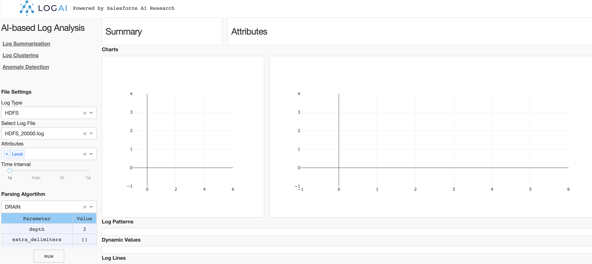

<!--
Copyright (c) 2022 Salesforce.com, inc.
All rights reserved.
SPDX-License-Identifier: BSD-3-Clause
For full license text, see the LICENSE file in the repo root or https://opensource.org/licenses/BSD-3-Clause

-->

<p align="center">
    <br>
    
    </br>
</p>

<div align="center">
  <a href="https://github.com/salesforce/logai/actions/workflows/tests.yml">
    
  </a>
  <a href="https://github.com/salesforce/logai/actions/workflows/pages/pages-build-deployment">
    
  </a>
  <a href="https://opensource.org/licenses/BSD-3-Clause">
    
  </a>
</div>

# LogAI: A Python Toolkit for AI-based Log Analytics

## Table of Contents
1. [Introduction](#introduction)
1. [Installation](#installation)
1. [Documentation](#documentation)

1. [Evaluation and Benchmarking](#evaluation-and-benchmarking)
1. [Technical Report and Citing LogAI](#technical-report-and-citing-logai)

## Introduction

Logs are the machine generated text messages of a computer program. In modern computer systems, logs are one of the most 
critical observability data for developers to understand system behavior, monitor system health and resolve issues. 
The volume of logs are huge for complex distributed systems, such as cloud, search engine, social media, etc. Log analytics, 
are tools for developers to process huge volume of raw logs and generate insights, in order to better handle system 
operations. While artificial intelligence (AI) and machine learning (ML) technologies are proven to be capable to improve 
productivity in a lot of domains, recently more and more AI tools are integrated in log analytics solutions, in both 
commercial and opensource software. However, there is still no sufficient toolkit that can handle multiple AI-based 
log analysis tasks in uniform way. We introduce LogAI, an one-stop toolkit for AI-based log analytics. 
LogAI provides AI and ML capabilities for log analysis. LogAI can be used for a variety of tasks such as log summarization, 
log clustering and log anomaly detection. LogAI adopts the same log data model as OpenTelemetry so the developed applications 
and models are eligible to logs from different log management platforms. LogAI provides a unified model interface and 
integrates with popular time-series models, statistical learning models and deep learning models. LogAI also provides 
an out-of-the-box GUI for users to conduct interactive analysis. With LogAI, we can also easily benchmark popular deep 
learning algorithms for log anomaly detection without putting in redundant effort to process the logs. LogAI can be used 
for different purposes from academic research to industrial prototyping. 

## Compare LogAI with other AI-based log analytics Tools
 
Below table compares LogAI with several existing AI-based log analytics Tools, include both commercial log management platforms
like NewRelic and DataDog, or popular log analysis open source tools on Github. 

| Coverage  | LogAI | NewRelic Log Monitoring | DataDog Log Explorer | logparser | loglizer | deep-loglizer | log3C | 
| ------------- | ------------- | ------------- |  ------------- | ------------- | ------------- | ------------- | ------------- |
| OpenTelemetry log data model  | :white_check_mark:  | :white_check_mark:  | :white_check_mark:  | | | | | | 
| Unified data loader and preprocessing | :white_check_mark:  | :white_check_mark:  | :white_check_mark:  | :white_check_mark:  | :white_check_mark:  | :white_check_mark: | |
| Auto log parsing  | :white_check_mark:  | :white_check_mark: | :white_check_mark: | | | 
| Log clustering | :white_check_mark: | :white_check_mark:  | :white_check_mark:  | | | | :white_check_mark: | 
| Log anomaly detection - time-series | :white_check_mark: | :white_check_mark:  | :white_check_mark:  | | | | | | 
| Log anomaly detection - traditional ML | :white_check_mark: |  |  | | :white_check_mark: |  |  |  
| Log anomaly detection - deep Learning | :white_check_mark: |  | | | :white_check_mark: | :white_check_mark: |  |  
| Huggingface integration | :white_check_mark: | | | | | |  |
| GUI for result visualization | :white_check_mark: | :white_check_mark: | :white_check_mark: | | | | |

## Installation

You can install LogAI using `pip install` with the instruction below:

```shell
git clone https://git.soma.salesforce.com/SalesforceResearch/logai.git
cd logai
python3 -m venv venv # create virtual environment
source venv/bin/activate # activate virtual env
pip install ./ # install LogAI from root directory
```

## Documentation

Below we briefly introduce several ways to explore and use LogAI, including exploring LogAI GUI
portal, benchmarking deep-learning based log anomaly detection using LogAI, and building your 
own log analysis application with LogAI.

### Explore LogAI GUI Portal 

You can also start a local LogAI service and use the GUI portal to explore LogAI.

```shell
export PYTHONPATH='.'  # make sure to add current root to PYTHONPATH
python3 gui/application.py # Run local plotly dash server.
```

Then open the LogAI portal via http://localhost:8050/ or http://127.0.0.1:8050/ in your browser:



The control panel is on the left side of the page. There are three applications you can choose from:
Log Summarization, Log Clustering and Anomaly Detection.

#### Control Panel

**File Setting**. You can select the log type and log files to be processed. Now LogAI supports three 
public datasets: HDFS, BGL and HealthApp. For each log type we included several sample log data. After
log file selected, you can choose the attributes you want to be inolved in log processing. The selected 
attributes will be treated as structured log attributes.

**Algortihm Setting**. For different applications, the algorithms options may be different.
For example, auto-log parsing algorithms are utilized for log summarization, but log clustering uses auto-parsing algorithms,
 vectorization algorithms, categorical encoding and clustering algorithms. You can select a
 algorithm and change the parameters in each algorithm section. After algortihm configuration, simply click "run" to
run the application.

#### Log Summarization

Log summarization App summarize and group the raw logs by log patterns and attributes. You can click on 
each log pattern and see what the pattern looks like and the dynamic values in each position. You can also 
see the chart of occurrance trend of this pattern on the right side.


#### Log Clustering

Log clustering App groups raw logs into clusters by calculating the semantic representation of each logline. 
Then using clustering algorithms to generate log clusters. In this example, we choose k-mean where `k==8` to
generate 8 clusters. The result is shown as a pie chart and you can click each portion of the pie chart to check
the raw logs in this cluster.


#### Anomaly Detection

Log anomaly detection App conduct log anomaly detection tasks. Similar to log clustering, log anomaly detection
also needs to extract information from raw logs and generate reprentation of loglines. Depend on the type of anomaly detection,
The representation can be different. 
**Time-series anomaly detection**. If we use time-series algorithm like ETS, the raw logs will be converted
into log counter vectors by given time interval. Then ETS is performed on the generated log counter vectors and detect
anomalous timestamps on the counter vector time-series. 

**Semantic anomaly detection**. If we use unsupervised outlier detection algorithms such as One-class SVM, the raw logs will 
be converted into semantic vectors and feed the One-class SVM model. Then the model will detect anomalous loglines.


LogAI GUI protal is just an example to demo LogAI capabilities. We know this may not be the best way to visualize the 
results and there might be bugs in how the results are displayed. We will keep working with the open source community
to improve usability of the portal. Any feedbacks and contributions are welcome :blush:. 

### Run Simple Time-series Anomaly Detection Application


### Run Deep-learning Anomaly Detection Benchmarking

Below is another sample `hdfs_log_anomaly_detection_unsupervised_lstm.yaml` yaml config file which provides the configs for each component of the log anomaly detection workflow on the public dataset HDFS using an unsupervised Deep-Learning based Anomaly Detector. 

```yaml
workflow_config:  
  label_filepath: "tests/logai/test_data/HDFS_AD/anomaly_label.csv"
  parse_logline: True  
  output_dir: "temp_output"
  output_file_type: "csv"
  training_type: "unsupervised"
  deduplicate_test: True
  test_data_frac_pos: 0.5
  dataset_name: hdfs

  data_loader_config:
    filepath: "tests/logai/test_data/HDFS_AD/HDFS_5k.log"
    reader_args: 
      log_format: "<Date> <Time> <Pid> <Level> <Component> <Content>"
    log_type: "log"
    dimensions:
      body: ['Content']
      timestamp: ['Date', 'Time']
    datetime_format: '%y%m%d %H%M%S'
    infer_datetime: True
    

  preprocessor_config:
    custom_delimiters_regex:
                [':', ',', '=', '\t']
    custom_replace_list: [
                ['(blk_-?\d+)', ' BLOCK '],
                ['/?/*\d+\.\d+\.\d+\.\d+',  ' IP '],
                ['(0x)[0-9a-zA-Z]+', ' HEX '],
                ['\d+', ' INT ']
            ]
    
  log_parser_config:
    parsing_algorithm: "drain"
    parsing_algo_params: 
      sim_th: 0.5
      depth: 5

  open_set_partitioner_config:
    session_window: False
    sliding_window: 10
    logsequence_delim: "[SEP]"


  log_vectorizer_config:
    algo_name: "forecast_nn"
    algo_param:
      feature_type: "sequential"
      sep_token: "[SEP]"
      max_token_len: 10
      embedding_dim: 100
      output_dir: "temp_output"
      vectorizer_model_dirpath: "temp_output/embedding_model"
      vectorizer_metadata_filepath: "temp_output/embedding_model/metadata.pkl"


  nn_anomaly_detection_config:
    algo_name: "lstm"
    algo_params:
        model_name: "lstm"
        learning_rate: 0.0001
        metadata_filepath: "temp_output/embedding_model/metadata.pkl"
        feature_type: "sequential"
        label_type: "next_log"
        eval_type: "session"
        num_train_epochs: 10
        batch_size: 4
        output_dir: "temp_output"

}
```

Then to run the end to end log anomaly detection on the HDFS dataset using LSTM Anomaly Detector (a sequence-based deep-learning model), you can simply create the below python script: 

```python
import os 
from logai.applications.openset.anomaly_detection.openset_anomaly_detection_workflow import OpenSetADWorkflowConfig
from logai.utils.file_utils import read_file
from logai.utils.dataset_utils import split_train_dev_test_for_anomaly_detection
from logai.dataloader.data_loader import FileDataLoader
from logai.preprocess.hdfs_preprocessor import HDFSPreprocessor
from logai.information_extraction.log_parser import LogParser
from logai.preprocess.openset_partitioner import OpenSetPartitioner
from logai.analysis.nn_anomaly_detector import NNAnomalyDetector
from logai.information_extraction.log_vectorizer import LogVectorizer
from logai.utils import constants

# Loading workflow config from yaml file 
config_path = "hdfs_log_anomaly_detection_unsupervised_lstm.yaml" # above config yaml file
config_parsed = read_file(config_path)
config_dict = config_parsed["workflow_config"]
validate_config_dict(config_dict)
config = OpenSetADWorkflowConfig.from_dict(config_dict)

# Loading raw log data as LogRecordObject 
dataloader = FileDataLoader(config.data_loader_config)
logrecord = dataloader.load_data()

# Preprocessing raw log data using dataset(HDFS) specific Preprocessor
preprocessor = HDFSPreprocessor(config.preprocessor_config, config.label_filepath)           
logrecord = preprocessor.clean_log(logrecord)

# Parsing the preprocessed log data using Log Parser
parser = LogParser(config.log_parser_config)
parsed_result = parser.parse(logrecord.body[constants.LOGLINE_NAME])
logrecord.body[constants.LOGLINE_NAME] = parsed_result[constants.PARSED_LOGLINE_NAME]

# Partitioning the log data into sliding window partitions, to get log sequences
partitioner = OpenSetPartitioner(config.open_set_partitioner_config)
logrecord = partitioner.partition(logrecord)

# Splitting the log data (LogRecordObject) into train, dev and test data (LogRecordObjects)
(train_data, dev_data, test_data) = split_train_dev_test_for_anomaly_detection(
                logrecord,training_type=config.training_type,
                test_data_frac_neg_class=config.test_data_frac_neg,
                test_data_frac_pos_class=config.test_data_frac_pos,
                shuffle=config.train_test_shuffle
            )

# Vectorizing the log data i.e. transforming the raw log data into vectors 
vectorizer = LogVectorizer(config.log_vectorizer_config)
vectorizer.fit(train_data)
train_features = vectorizer.transform(train_data)
dev_features = vectorizer.transform(dev_data)
test_features = vectorizer.transform(test_data)


# Training the neural anomaly detector model on the training log data 
anomaly_detector = NNAnomalyDetector(config=config.nn_anomaly_detection_config)
anomaly_detector.fit(train_features, dev_features)

# Running inference on the test log data to predict whether a log sequence is anomalous or not 
predict_results = anomaly_detector.predict(test_features)
print (predict_results)            
```
This kind of Anomaly Detection workflow for various Deep-Learning models and various experimental settings have also been automated in `logai.applications.openset.anomaly_detection.openset_anomaly_detection_workflow.OpenSetADWorkflow` class which can be easily invoked like the below example

```python
from logai.applications.openset.anomaly_detection.openset_anomaly_detection_workflow import OpenSetADWorkflow, get_openset_ad_config

TEST_DATA_PATH = "test_data/HDFS_AD/HDFS_5k.log"
TEST_LABEL_PATH = "test_data/HDFS_AD/anomaly_label.csv"
TEST_OUTPUT_PATH = "test_data/HDFS_AD/output"

kwargs = {
      "config_filename": "hdfs",
      "anomaly_detection_type": "lstm_sequential_unsupervised_parsed_AD",
      "vectorizer_type": "forecast_nn_sequential" ,
      "parse_logline": True ,
      "training_type": "unsupervised"
}

config = get_openset_ad_config(**kwargs)   

config.data_loader_config.filepath = TEST_DATA_PATH
config.label_filepath = TEST_LABEL_PATH
config.output_dir = TEST_OUTPUT_PATH
if not os.path.exists(config.output_dir):
    os.makedirs(config.output_dir)

workflow = OpenSetADWorkflow(config)
workflow.execute()
```

For more details of this workflow and more such examples please check the notebook tutorials in [nn_ad_benchmarking](examples/jupyter_notebook/nn_ad_benchmarking)


### Build LogAI Application
Please refer to [Build LogAI Application in Jupyter Notebook](examples/jupyter_notebook/jupyter_tutorial.md) for more information about how to
use LogAI modules to create E2E applications in Jupyter Notebook.


Please visit [LogAI Documentation]() for more detailed information.


## Technical Report and Citing LogAI

You can find more details about LogAI in the [technical report]().

If you're using LogAI in your research or applications, please cite using this BibTeX:

```
@article{logai2023,
      title={LogAI: A Python Toolkit for AI-based Log Analytics},
      author={Qian Cheng, Amrita Saha, Wenzhuo Yang, Chenghao Liu, Gerald Woo, Doyen Sahoo, Steven HOI},
      year={2023},
      eprint={?},
      archivePrefix={arXiv},
      primaryClass={cs.LG}
}
```

## Contact
If you have any questions, comments or suggestions, 
please do not hesitate to contact us at logai@salesforce.com. 

## License
[BSD 3-Clause License](LICENSE.txt)

