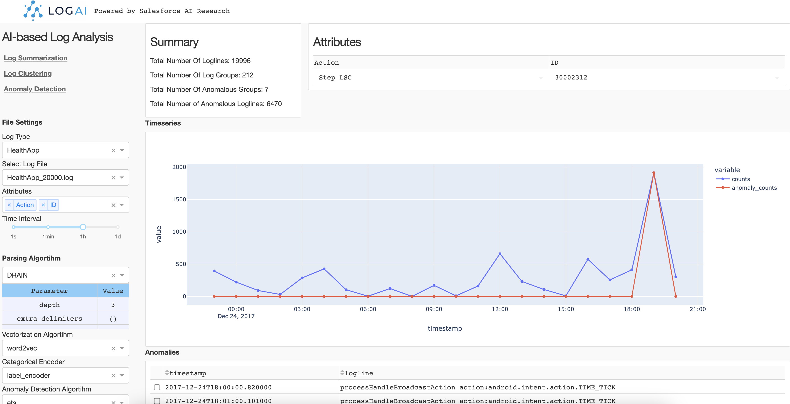

<!--
Copyright (c) 2023 Salesforce.com, inc.
All rights reserved.
SPDX-License-Identifier: BSD-3-Clause
For full license text, see the LICENSE file in the repo root or https://opensource.org/licenses/BSD-3-Clause

-->

<p align="center">
    <br>
    
    </br>
</p>

<div align="center">
  <a href="https://github.com/salesforce/logai/actions/workflows/tests.yml">
    
  </a>
  <a href="https://github.com/salesforce/logai/actions/workflows/pages/pages-build-deployment">
    
  </a>
  <a href="https://opensource.org/licenses/BSD-3-Clause">
    
  </a>
</div>

# LogAI: A Library for AI-based Log Analytics and Intelligence

## Table of Contents
* [Introduction](#introduction)
* [Installation](#installation)
* [Getting Started](#getting-started)
  * [Explore LogAI GUI Portal](#explore-logai-gui-portal)
  * [Run Simple Time-series Anomaly Detection Application](#run-simple-time-series-anomaly-detection-application)
  * [Build Customized LogAI Applications](#build-customized-logai-applications)
  * [Deep-learning Anomaly Detection Benchmarking](#deep-learning-anomaly-detection-benchmarking)
* [Documentation](#documentation)
* [Technical Report and Citing LogAI](#technical-report-and-citing-logai)
* [Contact](#contact)
* [Liscense](#license)

## Introduction

Software and System logs record runtime information about processes executing within a system. 
These logs have become the most critical and ubiquitous forms of observability data that help developers 
understand system behavior, monitor system health and resolve issues. However, the volume of logs generated can be 
humongous (of the order of petabytes per day) especially for complex distributed systems, such as cloud, 
search engine, social media, etc. This has propelled a lot of research on developing AI-based log based analytics and 
intelligence solutions that can process huge volume of raw logs and generate insights. In order to enable 
users to perform multiple types of AI-based log analysis tasks in a uniform manner, 
we introduce LogAI, a one-stop open source library for log analytics and intelligence. 
LogAI supports tasks such as log summarization, log clustering and log anomaly detection. 
It adopts the OpenTelemetry data model, to enable compatibility with different log management platforms. 
LogAI provides an unified model interface and provides popular time-series, statistical learning and deep 
learning models. Alongside this, LogAI also provides an out-of-the-box GUI for users to conduct interactive 
analysis. With LogAI, we can also easily benchmark popular deep learning algorithms for log anomaly detection 
without putting in redundant effort to process the logs. We have opensourced LogAI to cater to a wide range of 
applications benefiting both academic research and industrial prototyping.

## Compare LogAI with other AI-based Log Analysis Tools
 
Below table compares LogAI with several existing AI-based log analysis Tools, include both commercial log management platforms
like NewRelic and DataDog, or popular log analysis open source tools on Github. 

| Coverage  | LogAI | NewRelic Log Monitoring | DataDog Log Explorer | logparser | loglizer | deep-loglizer | log3C | 
| ------------- | ------------- | ------------- |  ------------- | ------------- | ------------- | ------------- | ------------- |
| OpenTelemetry log data model  | :white_check_mark:  | :white_check_mark:  | :white_check_mark:  | | | | | | 
| Unified data loader and preprocessing | :white_check_mark:  | :white_check_mark:  | :white_check_mark:  | :white_check_mark:  | :white_check_mark:  | :white_check_mark: | |
| Auto log parsing  | :white_check_mark:  | :white_check_mark: | :white_check_mark: | | | 
| Log clustering | :white_check_mark: | :white_check_mark:  | :white_check_mark:  | | | | :white_check_mark: | 
| Log anomaly detection - time-series | :white_check_mark: | :white_check_mark:  | :white_check_mark:  | | | | | | 
| Log anomaly detection - traditional ML | :white_check_mark: |  |  | | :white_check_mark: |  |  |  
| Log anomaly detection - deep Learning | :white_check_mark: |  | | | :white_check_mark: | :white_check_mark: |  |  
| Huggingface integration | :white_check_mark: | | | | | |  |
| GUI for result visualization | :white_check_mark: | :white_check_mark: | :white_check_mark: | | | | |

## Installation

You can install LogAI using `pip install` with the instruction below:

```shell
git clone https://git.soma.salesforce.com/SalesforceResearch/logai.git
cd logai
python3 -m venv venv # create virtual environment
source venv/bin/activate # activate virtual env
pip install ./ # install LogAI from root directory
```

## Getting Started

Below we briefly introduce several ways to explore and use LogAI, including exploring LogAI GUI
portal, benchmarking deep-learning based log anomaly detection using LogAI, and building your 
own log analysis application with LogAI.

### Explore LogAI GUI Portal 

You can also start a local LogAI service and use the GUI portal to explore LogAI.

```shell
export PYTHONPATH='.'  # make sure to add current root to PYTHONPATH
python3 gui/application.py # Run local plotly dash server.
```

Then open the LogAI portal via http://localhost:8050/ or http://127.0.0.1:8050/ in your browser:


The control panel is on the left side of the page. There are three applications you can choose from:
Log Summarization, Log Clustering and Anomaly Detection.

#### Control Panel

**File Setting**. You can select the log type and log files to be processed. Now LogAI supports three 
public datasets: HDFS, BGL and HealthApp. For each log type we included several sample log data. After
log file selected, you can choose the attributes you want to be involved in log processing. The selected 
attributes will be treated as structured log attributes.

**Algorithm Setting**. For different applications, the algorithms options may be different.
For example, auto-log parsing algorithms are utilized for log summarization, but log clustering uses auto-parsing algorithms,
 vectorization algorithms, categorical encoding and clustering algorithms. You can select an
 algorithm and change the parameters in each algorithm section. After algorithm configuration, simply click "run" to
run the application.

#### Log Summarization

Log summarization App summarize and group the raw logs by log patterns and attributes. You can click on 
each log pattern and see what the pattern looks like and the dynamic values in each position. You can also 
see the chart of occurrance trend of this pattern on the right side.


#### Log Clustering

Log clustering App groups raw logs into clusters by calculating the semantic representation of each logline. 
Then using clustering algorithms to generate log clusters. In this example, we choose k-mean where `k==8` to
generate 8 clusters. The result is shown as a pie chart and you can click each portion of the pie chart to check
the raw logs in this cluster.


#### Anomaly Detection

Log anomaly detection App conduct log anomaly detection tasks. Similar to log clustering, log anomaly detection
also needs to extract information from raw logs and generate representation of loglines. Depend on the type of anomaly detection,
The representation can be different. 
**Time-series anomaly detection**. If we use time-series algorithm like ETS, the raw logs will be converted
into log counter vectors by given time interval. Then ETS is performed on the generated log counter vectors and detect
anomalous timestamps on the counter vector time-series. 

**Semantic anomaly detection**. If we use unsupervised outlier detection algorithms such as One-class SVM, the raw logs will 
be converted into semantic vectors and feed the One-class SVM model. Then the model will detect anomalous loglines.



LogAI GUI portal is just an example to demo LogAI capabilities. We know this may not be the best way to visualize the 
results and there might be bugs in how the results are displayed. We will keep working with the open source community
to improve usability of the portal. Any feedbacks and contributions are welcome :blush:. 

### Run Simple Time-series Anomaly Detection Application

You can also use LogAI in more programtic ways. LogAI supports configuration files in `.json` or `.yaml`. 
Below is a sample `log_anomaly_detection_config.json` configuration for anomaly detection application. 
Make sure to set `filepath` to the target log dataset file path.

```json
{
      "open_set_data_loader_config": {
        "dataset_name": "HDFS",
        "filepath": ""
      },
      "preprocessor_config": {
          "custom_delimiters_regex":[]
      },
      "log_parser_config": {
        "parsing_algorithm": "drain",
        "parsing_algo_params": {
          "sim_th": 0.5,
          "depth": 5
        }
      },
      "feature_extractor_config": {
          "group_by_category": ["Level"],
          "group_by_time": "1s"
      },
      "log_vectorizer_config": {
          "algo_name": "word2vec"
      },
      "categorical_encoder_config": {
          "name": "label_encoder"
      },
      "anomaly_detection_config": {
          "algo_name": "one_class_svm"
      }
    }
```

Then to run log anomaly detection. You can simple create below python script:


```python
import json

from logai.applications.application_interfaces import WorkFlowConfig
from logai.applications.log_anomaly_detection import LogAnomalyDetection

# path to json configuration file
json_config = "./log_anomaly_detection_config.json"

# Create log anomaly detection application workflow configuration
config = json.loads(json_config)
workflow_config = WorkFlowConfig.from_dict(config) 

# Create LogAnomalyDetection Application for given workflow_config
app = LogAnomalyDetection(workflow_config)

# Execute App
app.execute()

```

Then you can check anomaly detection results by calling `app.anomaly_results`. 

For full context of this example please check
[Tutorial: Use Log Anomaly Detection Application](./examples/jupyter_notebook/log_anomaly_detection_example.ipynb).

### Build Customized LogAI Applications
You can build your own customized log analysis applications using LogAI. 
Please refer to [Build LogAI Application in Jupyter Notebook](examples/jupyter_notebook/jupyter_tutorial.md) 
for more information about how to
use LogAI modules to create E2E applications in Jupyter Notebook.

### Deep-learning Anomaly Detection Benchmarking

LogAI can be used to benchmark deep-learning anomaly detection results. 
A [tutorial](examples/jupyter_notebook/nn_ad_benchmarking/tutorial_lstm_deep_ad_hdfs.md) is provided for 
Anomaly Detection Benchmarking using LSTM anomaly detector for HDFS Dataset. More examples of deep-learning anomaly 
detection benchmarking on different datasets and algorithms can be found in 
[Deep Anomaly Detection Benchmarking Examples](examples/jupyter_notebook/nn_ad_benchmarking). 

Below table is the comparison between 
different supervised and unsupervised deep learning anomaly detection
models in LogAI and [Deep-Loglizer](https://github.com/logpai/deep-loglizer) library, using F1-Score as the 
performance metric. The dashed (-) cells indicate that there are no reported numbers in the Deep-Loglizer 
paper corresponding to those configurations.

<table>
    <thead>
        <tr>
            <th rowspan=2>Model</th>
            <th rowspan=2>Details</th>
            <th rowspan=2>Supervision</th>
            <th rowspan=2>Log Parsing</th>
            <th rowspan=2>Log Representation</th>
            <th colspan=2>HDFS</th>
            <th colspan=2>BGL</th>
        </tr>
        <tr>
            <th>LogAI</th>
            <th>Deep Loglizer</th>
            <th>LogAI</th>
            <th>Deep Loglizer</th>
        </tr>
    </thead>
    <tbody>
        <tr>
            <td rowspan=4>LSTM</td>
            <td rowspan=2>Undirectional, No Attention</td>
            <td rowspan=2>Unsupervised</td>
            <td>:heavy_check_mark:</td>
            <td>sequential</td>
            <td>0.981</td>
            <td>0.944</td>
            <td>0.938</td>
            <td>0.961</td>
        </tr>
        <tr>
            <td>:heavy_multiplication_x:</td>
            <td>semantic</td>
            <td>0.981</td>
            <td>0.945</td>
            <td>0.924</td>
            <td>0.967</td>
        </tr>
        <tr>
            <td rowspan=2>Bidirectional, with Attention</td>
            <td rowspan=2>Supervisedn</td>
            <td>:heavy_check_mark:</td>
            <td>sequntial</td>
            <td>0.979</td>
            <td>-</td>
            <td>0.925</td>
            <td>-</td>
        </tr>
        <tr>
            <td>:heavy_multiplication_x:</td>
            <td>semantic</td>
            <td>0.981</td>
            <td>-</td>
            <td>0.924</td>
            <td>-</td>
        </tr>
        <tr>
            <td rowspan=4>CNN</td>
            <td rowspan=4>2-D Convolution with 1-D Max Pooling</td>
            <td rowspan=2>Unsupervised</td>
            <td>:heavy_check_mark:</td>
            <td>sequential</td>
            <td>0.981</td>
            <td>-</td>
            <td>0.929</td>
            <td>-</td>
        </tr>
        <tr>
            <td>:heavy_multiplication_x:</td>
            <td>sequential</td>
            <td>0.981</td>
            <td>-</td>
            <td>0.922</td>
            <td>-</td>
        </tr>
        <tr>
            <td rowspan=2>Supervised</td>
            <td>:heavy_check_mark:</td>
            <td>sequential</td>
            <td>0.943</td>
            <td>0.97</td>
            <td>0.983</td>
            <td>-</td>
        </tr>
        <tr>
            <td>:heavy_multiplication_x:</td>
            <td>sequential</td>
            <td>0.946</td>
            <td>-</td>
            <td>0.99</td>
            <td>-</td>
        </tr>
        <tr>
            <td rowspan=8>Transformer</td>
            <td rowspan=8>Multihead single-layer self-attention model, trained from scratch</td>
            <td rowspan=4>Unsupervised</td>
            <td rowspan=2>:heavy_check_mark:</td>
            <td>sequential</td>
            <td>0.971</td>
            <td>0.905</td>
            <td>0.933</td>
            <td>0.956</td>
        </tr>
        <tr>
            <td>semantic</td>
            <td>0.978</td>
            <td>925</td>
            <td>0.921</td>
            <td>0.957</td>
        </tr>
        <tr>
            <td rowspan=2>:heavy_multiplication_x:</td>
            <td>sequential</td>
            <td>0.98</td>
            <td>-</td>
            <td>0.92</td>
            <td>-</td>
        </tr>
        <tr>
            <td>semantic</td>
            <td>0.975</td>
            <td>-</td>
            <td>0.917</td>
            <td>-</td>
        </tr>
        <tr>
            <td rowspan=4>Supervised</td>
            <td rowspan=2>:heavy_check_mark:</td>
            <td>sequential</td>
            <td>0.934</td>
            <td>-</td>
            <td>0.986</td>
            <td>-</td>
        </tr>
        <tr>
            <td>semantic</td>
            <td>0.784</td>
            <td>-</td>
            <td>0.963</td>
            <td>-</td>
        </tr>
        <tr>
            <td rowspan=2>:heavy_multiplication_x:</td>
            <td>sequential</td>
            <td>0.945</td>
            <td>-</td>
            <td>0.994</td>
            <td>-</td>
        </tr>
        <tr>
            <td>semantic</td>
            <td>0.915</td>
            <td>-</td>
            <td>0.977</td>
            <td>-</td>
        </tr>
    </tbody>
</table>


## Documentation

For more detail about LogAI library and advanced use cases, please visit [LogAI Documentation]().


## Technical Report and Citing LogAI

You can find more details about LogAI in the [technical report]().

If you're using LogAI in your research or applications, please cite using this BibTeX:

```
@article{logai2023,
      title={LogAI: A Toolkit for AI-based Log Analysis},
      author={Qian Cheng, Amrita Saha, Wenzhuo Yang, Chenghao Liu, Gerald Woo, Doyen Sahoo, Steven HOI},
      year={2023},
      eprint={?},
      archivePrefix={arXiv},
      primaryClass={cs.LG}
}
```

## Contact
If you have any questions, comments or suggestions, 
please do not hesitate to contact us at [logai@salesforce.com](logai@salesforce.com). 

## License
[BSD 3-Clause License](LICENSE.txt)

