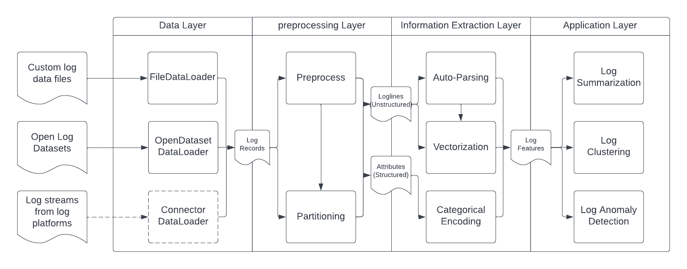

.. role:: file (code)
  :language: shell
  :class: highlight

===============================================
Welcome to LogAI!
===============================================

.. image:: logai_logo.jpg
   :width: 600
   :align: center

Table of Content
===============================================

.. toctree::
   :maxdepth: 2

   .

Introduction
===============================================
In this section we briefly introduce LogAI, a Python toolkit for AI-based Log Analytics

What is LogAI?
-----------------------------------------------

LogAI is a one-stop python toolkit for AI-based log analytics. LogAI provides artificial intelligence (AI) and machine learning (ML) capabilities for log analysis.
LogAI can be used for a variety of tasks such as log summarization, log clustering and log anomaly detection.
LogAI adopts the same log data model as OpenTelemetry so the developed applications and models are eligible to logs from different log management platforms.
LogAI provides a unified model interface and integrates with popular time-series models, statistical learning models and deep learning models.
LogAI also provides an out-of-the-box GUI for users to conduct interactive analysis. With LogAI, we can also easily benchmark popular deep learning algorithms for log anomaly detection without putting in redundant effort to process the logs.

LogAI Architecture
-----------------------------------------------
LogAI is separated into the GUI module and core library module.

.. Plotly Dash: https://github.com/plotly/dash

LogAI Core Library
~~~~~~~~~~~~~~~~~~~~~~~~~~~~~~~~~~~~~~~~~~~~~~~

The core library module contains four main layers: data layer, pre-processing layer, information extraction layer and
analysis layer. Each layer contains the components to process logs in a standard way. LogAI applications, such as log
summarization, log clustering, unsupervised log anomaly detection, are created on top of the components of the four
layers.

LogAI GUI Portal
~~~~~~~~~~~~~~~~~~~~~~~~~~~~~~~~~~~~~~~~~~~~~~~

The GUI module contains the implementation
of a GUI portal that talks to backend analysis applications. The portal is supported using `Plotly Dash
<https://github.com/plotly/dash>`_.

Get Start
===============================================

Installation
-----------------------------------------------

You can install LogAI using :file:`pip install` with the instruction below:

.. code-block:: shell

   git clone https://git.soma.salesforce.com/SalesforceResearch/logai.git
   cd logai
   python3 -m venv venv # create virtual environment
   source venv/bin/activate # activate virtual env
   pip install ./ # install LogAI from root directory

You can also start a local LogAI service and use the GUI portal to explore LogAI.

.. code-block:: shell

   export PYTHONPATH='.'  # make sure to add current root to PYTHONPATH
   python3 gui/application.py # Run local plotly dash server.

Then open the LogAI portal via :file:`http://localhost:8050/` or :file:`http://127.0.0.1:8050/` in your browser:

.. image:: log_summarization.png
   :width: 750

Documentation
===============================================
.. toctree::
   :maxdepth: 2
   :caption: Tutorial

   tutorial

.. toctree::
   :maxdepth: 2
   :caption: Developer Guide

   develop

.. toctree::
   :maxdepth: 2
   :caption: LogAI Core Modules

   modules

Indices and tables
==================

* :ref:`genindex`
* :ref:`modindex`
* :ref:`search`
