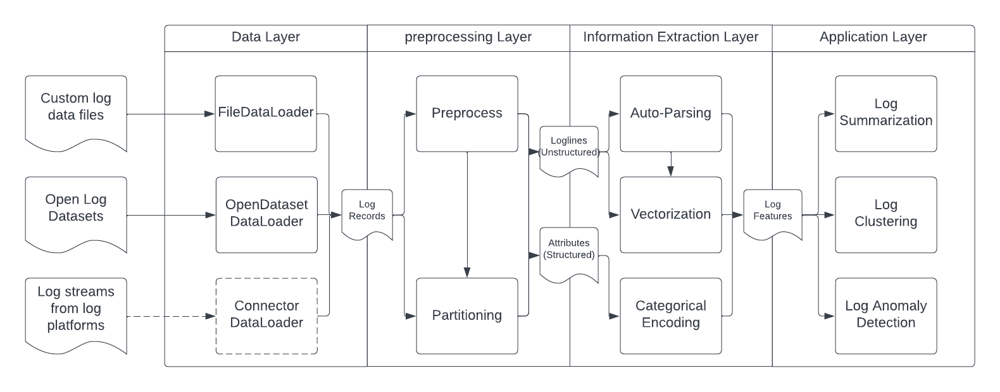
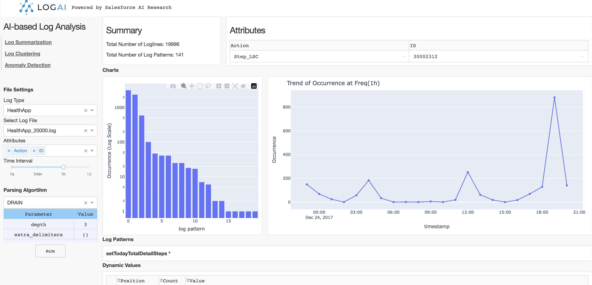

.. image:: _static/logai_logo.jpg
   :width: 650
   :align: center

Introduction
===============================================

Software and System logs record runtime information about processes executing within a system.
These logs have become the most critical and ubiquitous forms of observability data that help developers
understand system behavior, monitor system health and resolve issues. However, the volume of logs generated can be
humongous (of the order of petabytes per day) especially for complex distributed systems, such as cloud,
search engine, social media, etc. This has propelled a lot of research on developing AI-based log based analytics and
intelligence solutions that can process huge volume of raw logs and generate insights. In order to enable
users to perform multiple types of AI-based log analysis tasks in a uniform manner,
we introduce LogAI, a one-stop open source library for log analytics and intelligence.
LogAI supports tasks such as log summarization, log clustering and log anomaly detection.
It adopts the OpenTelemetry data model, to enable compatibility with different log management platforms.
LogAI provides an unified model interface and provides popular time-series, statistical learning and deep
learning models. Alongside this, LogAI also provides an out-of-the-box GUI for users to conduct interactive
analysis. With LogAI, we can also easily benchmark popular deep learning algorithms for log anomaly detection
without putting in redundant effort to process the logs. We have opensourced LogAI to cater to a wide range of
applications benefiting both academic research and industrial prototyping.

LogAI Architecture
-----------------------------------------------
LogAI is separated into the GUI module and core library module.

LogAI Core Library
-----------------------------------------------

The core library module contains four main layers: data layer, pre-processing layer, information extraction layer and
analysis layer. Each layer contains the components to process logs in a standard way. LogAI applications, such as log
summarization, log clustering, unsupervised log anomaly detection, are created on top of the components of the four
layers.

LogAI GUI Portal
-----------------------------------------------

The GUI module contains the implementation
of a GUI portal that talks to backend analysis applications. The portal is supported using `Plotly Dash
<https://github.com/plotly/dash>`_.

