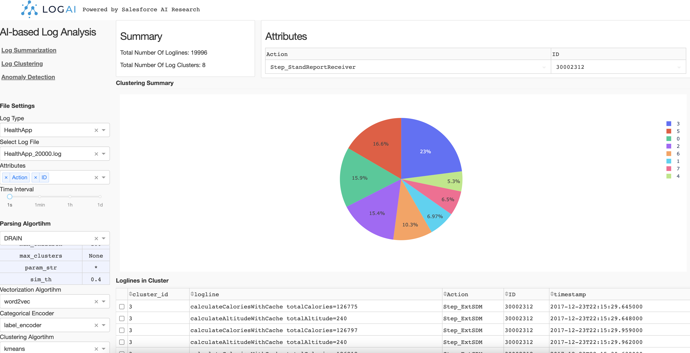
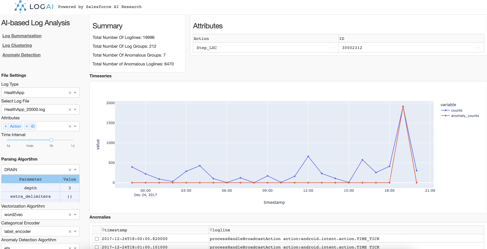

.. role:: file (code)
  :language: shell
  :class: highlight

.. image:: _static/logai_logo.jpg
   :width: 650
   :align: center

Explore LogAI GUI Portal
====================================

You can also start a local LogAI service and use the GUI portal to explore LogAI.

.. code-block:: shell

    export PYTHONPATH='.'  # make sure to add current root to PYTHONPATH
    python3 gui/application.py # Run local plotly dash server.

Then open the LogAI portal via :file:`http://localhost:8050/` or :file:`http://127.0.0.1:8050/` in your browser:

.. image:: _static/logai_gui_landing.png
   :width: 750

The control panel is on the left side of the page. There are three applications you can choose from:
Log Summarization, Log Clustering and Anomaly Detection.

Control Panel
-----------------------------------------------------------------------

**File Setting**. You can select the log type and log files to be processed. Now LogAI supports three
public datasets: HDFS, BGL and HealthApp. For each log type we included several sample log data. After
log file selected, you can choose the attributes you want to be involved in log processing. The selected
attributes will be treated as structured log attributes.

**Algorithm Setting**. For different applications, the algorithms options may be different.
For example, auto-log parsing algorithms are utilized for log summarization, but log clustering uses
auto-parsing algorithms, vectorization algorithms, categorical encoding and clustering algorithms. You can select a
algorithm and change the parameters in each algorithm section. After algorithm configuration, simply click :file:`run` to
run the application.

Log Summarization
-------------------------------------------------------------

Log summarization App summarize and group the raw logs by log patterns and attributes. You can click on
each log pattern and see what the pattern looks like and the dynamic values in each position. You can also
see the chart of occurrance trend of this pattern on the right side.

.. image:: _static/logai_summarization_res.png
   :width: 750

Log Clustering
-------------------------------------------------------------

Log clustering App groups raw logs into clusters by calculating the semantic representation of each logline.
Then using clustering algorithms to generate log clusters. In this example, we choose k-mean where `k==8` to
generate 8 clusters. The result is shown as a pie chart and you can click each portion of the pie chart to check
the raw logs in this cluster.

Anomaly Detection
-------------------------------------------------------------

Log anomaly detection App conduct log anomaly detection tasks. Similar to log clustering, log anomaly detection
also needs to extract information from raw logs and generate reprentation of loglines. Depend on the type of anomaly detection,
The representation can be different.
**Time-series anomaly detection**. If we use time-series algorithm like ETS, the raw logs will be converted
into log counter vectors by given time interval. Then ETS is performed on the generated log counter vectors and detect
anomalous timestamps on the counter vector time-series.

**Semantic anomaly detection**. If we use unsupervised outlier detection algorithms such as One-class SVM, the raw logs will
be converted into semantic vectors and feed the One-class SVM model. Then the model will detect anomalous loglines.

LogAI GUI portal is just an example to demo LogAI capabilities. We know this may not be the best way to visualize the
results and there might be bugs in how the results are displayed. We will keep working with the open source community
to improve usability of the portal. Any feedbacks and contributions are welcome :blush:.
